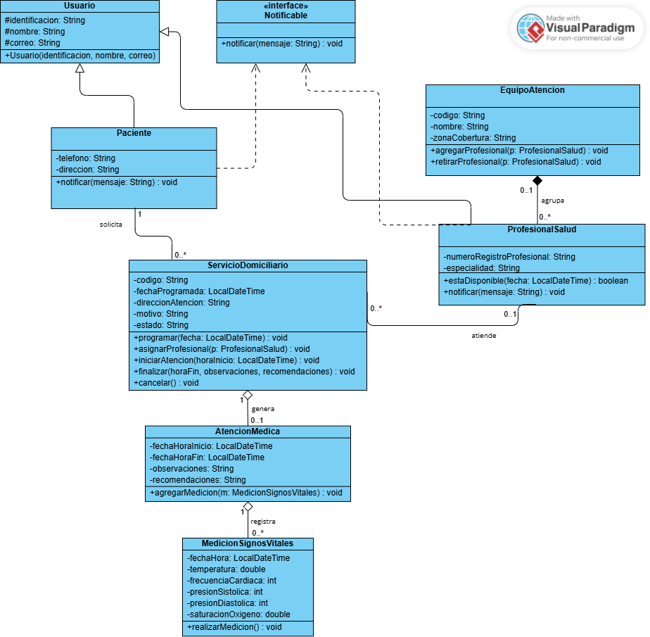

# MediHome – Sistema de atención médica domiciliaria

## Integrantes

- Nicoll Valentina López Andrade
- Mario Alberto Zambrano Muñoz

## Descripción

MediHome es un sistema para la administración de servicios de atención médica domiciliaria. Permite que un paciente solicite un servicio a domicilio, que se le asigne un profesional de salud perteneciente a un equipo de atención y que, durante la visita, se registren la atención médica y las mediciones de signos vitales. El proyecto está desarrollado en Java aplicando programación orientada a objetos (herencia, interfaces, agregación y composición) y modelado en UML con Visual Paradigm.

## Diagrama de clases

Archivo fuente del diagrama (Visual Paradigm): [diagrama/MediHome.vpp](diagrama/MediHome.vpp)

## Código fuente

El código Java se encuentra en: [MediHome/MediHome/src/com/medihome](MediHome/MediHome/src/com/medihome)
